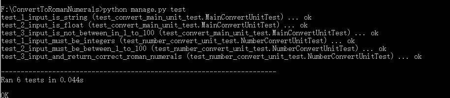
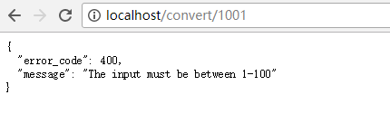
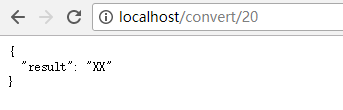

# ConvertToRomanNumerals
1-100阿拉伯数组转罗马数字接口

## 1.描述
>API接口把整数转换成罗马数字（整数范围是1-100）
<pre>用HTTP GET请求,input是一个整数，path是 /convert
例子：
uri：/convert?input=20
返回：json
{
    result：“XX”
}

如果输入值不在1-100范围内，返回格式如下,HTTP状态码为400（bad request）：
{
  "error_code": 400, 
  "message": "The error messages!"
}
</pre>

## 2.目录结构
<pre>
ConvertToRomanNumerals
  |
  |—— app/                                    # app 包
  |   |—— __init__.py                           # 工厂方法，crate_app
  |   |—— ResponseError.py                      # 自定义错误响应类
  |   |—— convert/                              # convert蓝本
  |       |—— __init__.py
  |       |—— views.py
  |—— test/                                   # 测试包
  |    |—— __init__.py
  |    |—— test_convert_main_unit_test.py      # convert.views中的convert视图函数单元测试类
  |    |—— test_number_convert_unit_test.py    # tool.NumberConvert.convert_to_roman_numerals 函数单元测试类
  |—— tool/                                  # 工具包
  |    |—— __init__.py
  |    |—— NumberConvert.py                    #转1-100之间阿拉伯整数为罗马数字形式
  |—— manage.py                              # 管理项目
  |—— requirements.txt                       # 配置需求
</pre>
## 3.运行
<pre>
测试
python manage.py test
运行
python manage.py runserver -p 80
</pre>
## 4.效果

